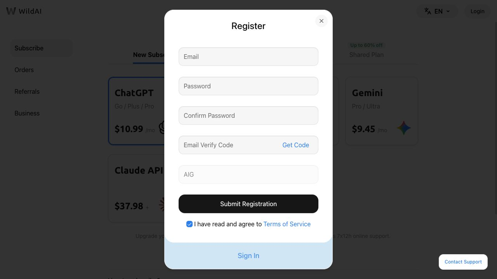

# WildAI 邀请码 AIG：如何填写及优惠说明

> 最后核对：2026-08-20。活动可能调整，请以 WildAI 注册页面实时显示为准。

## 邀请码是什么

根据 WildAI 当前注册页面的活动说明，注册时填写邀请码 **AIG**，可以额外优惠 **1 美元**。

注册链接：<https://bewild.ai/?code=AIG>



*截图核对日期：2026-08-20。链接已自动将邀请码填写为 AIG；截图未填写任何个人信息。*

链接中的 `code=AIG` 用于携带邀请码。如果打开注册页面后邀请码没有自动出现，请在邀请码输入框中手动填写：

```text
AIG
```

## 使用前检查

1. 确认浏览器地址栏域名是 `bewild.ai`；
2. 确认邀请码栏显示 `AIG`；
3. 确认优惠已经在注册或结算页面体现；
4. 核对最终价格、服务周期和退款规则；
5. 阅读服务条款与隐私政策后再决定。

## 为什么仍然要以页面为准

邀请码活动可能调整、暂停，或者只适用于特定用户和产品。本项目记录的是核对日期当天注册页面展示的信息，不能保证未来永久保持不变。如果页面没有显示减免，不要只根据本文章完成付款。

## 推广关系说明

该链接包含邀请码 AIG。用户通过链接注册或购买后，本项目维护者可能获得推广收益，但不会因此增加用户支付价格。本项目不参与 WildAI 的交易、账号操作、退款或售后。

## 非官方声明

本项目是独立维护的信息指南，不属于 OpenAI 或 WildAI，与 OpenAI 不存在隶属、授权或官方合作关系。第三方订阅是否适合你，需要结合其服务条款、隐私处理和账号风险自行判断。
